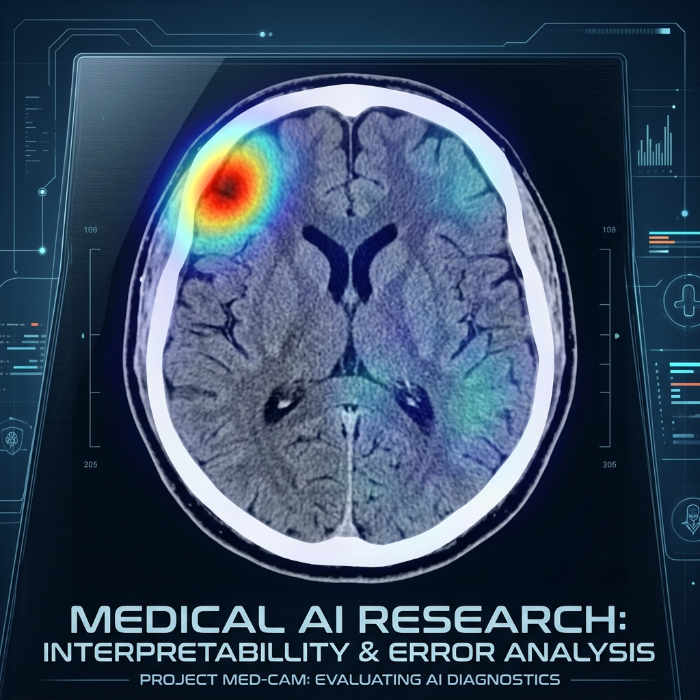

  
  
  # 🧠 Clinical AI Audit: RSNA Intracranial Hemorrhage
  
  **Transforming a deep learning classification model into a clinically validated, interpretable Medical AI.**

---

## 🔬 Project Overview
This repository documents the clinical validation and adversarial audit of an EfficientNetB0-based deep learning model designed to detect Intracranial Hemorrhage (ICH) and its 5 subtypes from 16-bit CT scans.

Unlike traditional Kaggle notebooks that focus solely on AUC scores, this project focuses on **Interpretability (XAI), Error Analysis, and Clinical Safety**. We applied rigorous radiological "Dual-Validation" to ensure the AI makes decisions based on genuine pathology, not spurious correlations.

---

## 🛠️ Methodology & Innovations

### 1. Advanced Windowing (DICOM to RGB)
Instead of relying on single-channel grayscale, we utilized a multi-windowing technique to capture different anatomical structures. The 16-bit DICOM arrays were mapped to 3-channel RGB tensors:
- **Red Channel:** Brain Window (W:80, L:40)
- **Green Channel:** Subdural Window (W:200, L:80)
- **Blue Channel:** Bone Window (W:2800, L:600)

### 2. The "Clever Hans" Effect & Explainable AI (Grad-CAM)
We deployed Grad-CAM (Gradient-weighted Class Activation Mapping) on the final convolutional layer (`top_activation`) to visualize the model's spatial focus. 
**Key Finding:** The model initially exhibited a high False Positive rate (51%). Grad-CAM revealed that the AI was erroneously fixating on **calcifications, aneurysm coils, catheters, and frontal bone partial volume artifacts**, rather than the hemorrhage itself. It had learned spurious correlations instead of actual pathology.

### 3. Precision-Recall Trade-off via Dropout Tuning
To combat the frontal bone bias, we aggressively increased Dropout to 50% and applied Hard Negative Mining. While this successfully reduced False Positives (from 51% to 11%), it caused a catastrophic drop in Recall (missing 75% of actual bleeds).
By carefully re-tuning the Dropout rate down to **20%**, we restored the model's confidence, significantly dropping the False Negative rate while maintaining a healthy balance in False Positives—demonstrating a textbook hyperparameter sweet spot.

### 4. The Skull-Stripping Experiment
To test the hypothesis that the bright skull bone obfuscates superficial bleeds, we designed an OpenCV-based morphological Skull-Stripping algorithm. We tested it on a cohort of 200 unseen patients:
- **Intraparenchymal (Deep) Bleeds (n=100):** Detection improved in 28% of cases.
- **Subdural/Epidural (Superficial) Bleeds (n=100):** Detection significantly improved in **36%** of cases.
**Clinical Conclusion:** The skull bone acts as a massive visual noise generator for the CNN. Stripping the bone removes the distraction, allowing the AI to detect superficial hematomas with much higher confidence.

---

## ⚠️ Academic Vulnerabilities & Future Work
To ensure scientific integrity, we identified 5 critical vulnerabilities in the current architecture:
1. **Slice vs. Volume Gap:** The model analyzes 2D slices independently, ignoring the 3D anatomical continuity of bleeds (requires 3D CNN or LSTM).
2. **HU (Hounsfield Unit) Loss:** Compressing 16-bit raw medical data into 8-bit RGB channels causes a loss of critical density thresholds.
3. **ImageNet Bias:** The base EfficientNet was pre-trained on natural images (cats/cars), requiring extensive deep fine-tuning for millimeter-level medical textures.
4. **The Prevalence Trap:** Imbalanced training data leads to heavy class biases unless meticulously corrected via Hard Negative Mining.
5. **The XAI Illusion:** Grad-CAM heatmaps highlight where the AI looks, but they do not guarantee the AI understands *why* it is looking there.

---

## 🚀 How to Run
*(Instructions on how to run the Jupyter Notebook will be placed here)*

---
> **Note:** This project is a hybrid outcome of radiological vision and technical engineering, built to serve as a robust medical AI portfolio piece.
